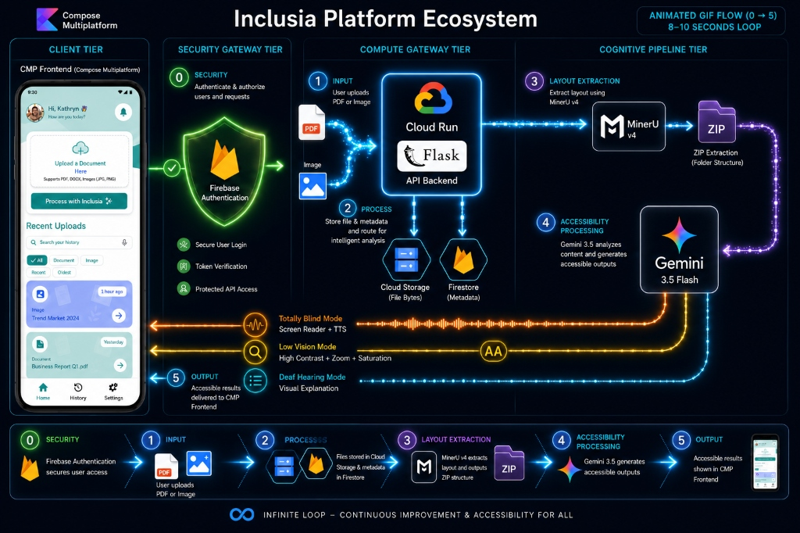
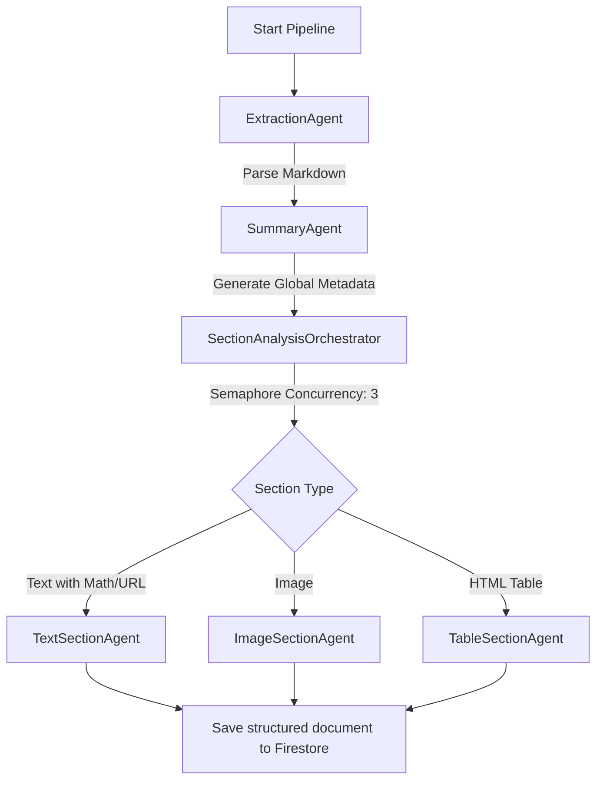

# Inclusia Backend: Cognitive Multi-Agent Accessibility Pipeline

Inclusia is a cognitive accessibility platform designed to break barriers in learning materials for students with sensory disabilities. It parses educational materials (PDFs, Images) and reconstructs them into three optimized accessibility modalities: **Totally Blind Mode** (TTS/Screen Reader optimized), **Low Vision Mode** (concise, high contrast descriptions), and **Deaf/Hard of Hearing Mode** (structured, simple visual explanations).

The backend is built with **Flask**, containerized for **Google Cloud Run**, and orchestrated using **Google's Agent Development Kit (ADK)** version 1.18.0 as a highly resilient, cognitive multi-agent pipeline.

---

## 🏗️ Architecture Ecosystem



The platform is organized into four major logical tiers:

1. **Client Tier (Compose Multiplatform)**:
   - Mobile frontend application built on Jetpack Compose Multiplatform for cross-platform access.
2. **Security Gateway Tier (Firebase Auth)**:
   - Authenticates and authorizes all client requests using Firebase Token Verification.
3. **Compute Gateway Tier (Flask + Google Cloud)**:
   - Hosts the REST API on **Google Cloud Run**.
   - Handles storage of document artifacts in **Google Cloud Storage** and metadata in **Firestore**.
4. **Cognitive Pipeline Tier (ADK Multi-Agent)**:
   - Extracts layout using **MinerU v4**.
   - Runs structured Gemini models coordinated by cooperative ADK agents.

---

## 🤖 ADK Multi-Agent System Design

To prevent rate-limit failures (429) and isolate parsing concerns, the backend uses a sequential multi-agent orchestration workflow.



### 1. Agents Directory Layout (`backend/agents/`)
- `extraction_agent.py`: Downloads file from GCS, coordinates layout/text parser, and pushes text to session state.
- `summary_agent.py`: Analyzes the entire text to build a global summary, key topics, and suggested starter questions using Pydantic validation schemas.
- `section_agents.py`: Contains the individual layout specialists and their orchestrator:
  - `TextSectionAgent`: Formats LaTeX formulas, math operators, and URL links into natural spoken Indonesian sentences.
  - `ImageSectionAgent`: Receives visual inputs (PIL image) and descriptions before/after, generating alternative texts for screen readers and simple visual bullets for deaf students.
  - `TableSectionAgent`: Translates raw HTML tables into linear blind readings, low vision summaries, and simplified layouts.
  - `SectionAnalysisOrchestrator`: Manages concurrency limits (max 3 concurrent API calls) using `asyncio.Semaphore`.
- `workflow.py`: Composes the sequential workflow (`document_pipeline`) containing all three core processing agents.
- `chat_agent.py`: Integrates a stateful chat session inside ADK to help students tutor themselves based on document contents.
- `feedback_agent.py`: Analyzes user-submitted negative flags or comments and programmatically rewrites system prompts inside Firestore.

---

## 🛠️ Tech Stack & Dependencies

- **Framework**: Python 3.9/3.12, Flask, Flask-CORS
- **Cognitive Agents**: `google-adk==1.18.0`, `google-genai`
- **Cloud Infrastructure**: Firebase Admin SDK (Auth & Firestore), Google Cloud Storage
- **PDF & Layout Parsing**: MinerU v4, PyMuPDF
- **Testing**: `unittest`

---

## 🚀 Getting Started

### 1. Prerequisites
- Python 3.9 or above (Python 3.10+ recommended)
- Firebase Project setup with Service Account Key file (`serviceAccountKey.json`)
- Gemini API Key

### 2. Local Environment Setup

Clone this repository and go to the backend directory:
```bash
cd backend
python -m venv venv
source venv/bin/activate
pip install -r requirements.txt
```

### 3. Credentials Configuration
Create a `.env` file in the `backend/` directory:
```env
GEMINI_API_KEY=your_gemini_api_key_here
PORT=5001
FLASK_ENV=development
```
Place your Firebase Admin SDK service account key file inside `backend/firebase/serviceAccountKey.json`.

### 4. Running the App Locally
```bash
python app.py
```
The server will start running at `http://localhost:5001`.

### 5. Running the Tests
To verify all integrations, database mocks, and agent orchestrators, run:
```bash
python -m unittest discover tests
```

---

## 📂 API Endpoints Summary

### Documents
- `POST /api/v1/documents/upload`: Uploads a PDF/Image file.
- `POST /api/v1/documents/<doc_id>/process`: Triggers the ADK pipeline process in a background thread.
- `GET /api/v1/documents/<doc_id>`: Retrieves processing progress, sections, and global summaries.

### Interactive Tutoring Chat
- `POST /api/v1/documents/<doc_id>/chat`: Asks a question to the stateful `ChatAgent` based on document context.

### User Feedback & Optimization Loop
- `POST /api/v1/feedback`: Submits a rating and flags (e.g. "Too Complicated", "Inaccurate").
- `POST /api/v1/feedback/optimize`: Runs the `FeedbackOptimizationAgent` to automatically refine prompts.
