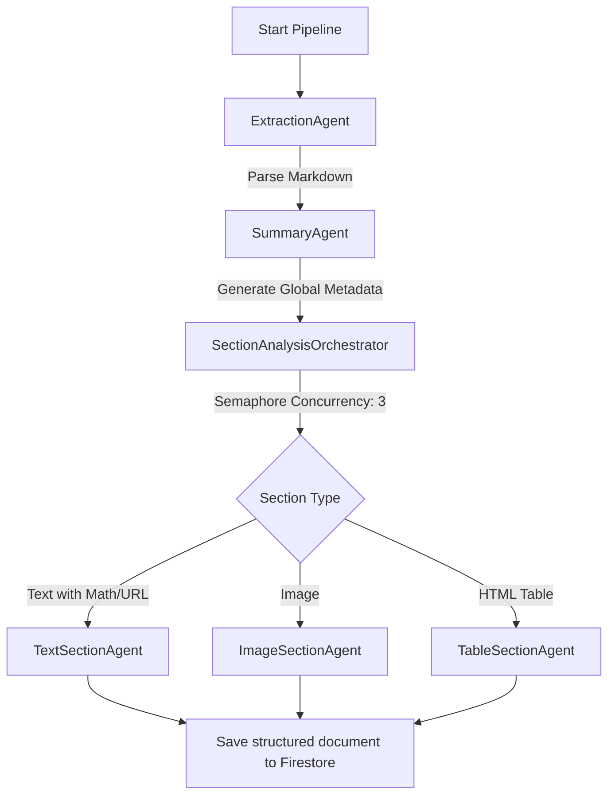

# Inclusia Backend: Cognitive Multi-Agent Accessibility Pipeline

Inclusia is a cognitive accessibility platform designed to break barriers in learning materials for students with sensory disabilities. It parses educational materials (PDFs, Images) and reconstructs them into three optimized accessibility modalities: **Totally Blind Mode** (TTS/Screen Reader optimized), **Low Vision Mode** (concise, high contrast descriptions), and **Deaf/Hard of Hearing Mode** (structured, simple visual explanations).

The backend is built with **Flask**, containerized for **Google Cloud Run**, and orchestrated using **Google's Agent Development Kit (ADK)** version 1.18.0 as a highly resilient, cognitive multi-agent pipeline.

---

## 🏗️ Architecture Ecosystem


The platform is organized into four major logical tiers:

1. **Client Tier (Compose Multiplatform)**:
   - Mobile frontend application built on Jetpack Compose Multiplatform for cross-platform access.
2. **Security Gateway Tier (Firebase Auth)**:
   - Authenticates and authorizes all client requests using Firebase Token Verification.
3. **Compute Gateway Tier (Flask + Google Cloud)**:
   - Hosts the REST API on **Google Cloud Run**.
   - Handles storage of document artifacts in **Google Cloud Storage** and metadata in **Firestore**.
4. **Cognitive Pipeline Tier (ADK Multi-Agent)**:
   - Extracts layout using **MinerU v4**.
   - Runs structured Gemini models coordinated by cooperative ADK agents.

---

## 🤖 ADK Multi-Agent System Design

To prevent rate-limit failures (429) and isolate parsing concerns, the backend uses a sequential multi-agent orchestration workflow.



### 1. Agents Directory Layout (`backend/agents/`)
- `extraction_agent.py`: Downloads file from GCS, coordinates layout/text parser, and pushes text to session state.
- `summary_agent.py`: Analyzes the entire text to build a global summary, key topics, and suggested starter questions using Pydantic validation schemas.
- `section_agents.py`: Contains the individual layout specialists and their orchestrator:
  - `TextSectionAgent`: Formats LaTeX formulas, math operators, and URL links into natural spoken Indonesian sentences.
  - `ImageSectionAgent`: Receives visual inputs (PIL image) and descriptions before/after, generating alternative texts for screen readers and simple visual bullets for deaf students.
  - `TableSectionAgent`: Translates raw HTML tables into linear blind readings, low vision summaries, and simplified layouts.
  - `SectionAnalysisOrchestrator`: Manages concurrency limits (max 3 concurrent API calls) using `asyncio.Semaphore`.
- `workflow.py`: Composes the sequential workflow (`document_pipeline`) containing all three core processing agents.
- `chat_agent.py`: Integrates a stateful chat session inside ADK to help students tutor themselves based on document contents.
- `feedback_agent.py`: Analyzes user-submitted negative flags or comments and programmatically rewrites system prompts inside Firestore.

---

## 🛠️ Tech Stack & Dependencies

- **Framework**: Python 3.9/3.12, Flask, Flask-CORS
- **Cognitive Agents**: `google-adk==1.18.0`, `google-genai`
- **Cloud Infrastructure**: Firebase Admin SDK (Auth & Firestore), Google Cloud Storage
- **PDF & Layout Parsing**: MinerU v4, PyMuPDF
- **Testing**: `unittest`

---

## 🚀 Getting Started

Follow the steps below to set up Inclusia Backend locally and deploy it to Cloud Run.

### 1. External Services Setup

#### A. Gemini API Setup
1. Visit [Google AI Studio](https://aistudio.google.com/).
2. Create or select a Google Cloud project.
3. Click **Get API key** and copy your generated key.
4. Keep this key handy to use as `GEMINI_API_KEY` in the environment configuration.

#### B. Firebase Setup
1. Open the [Firebase Console](https://console.firebase.google.com/).
2. Click **Add Project** and create a new project (e.g., `inclusia-accessibility`).
3. **Authentication**: Enable Authentication from the sidebar and configure your desired Sign-in providers (e.g., Email/Password, Google).
4. **Firestore Database**: Navigate to Firestore Database, click **Create database**, choose your location, and set your starting security rules.
5. **Storage**: Navigate to Storage, click **Get Started**, choose your location, and configure rules. Take note of the storage bucket URL (e.g., `your-project.firebasestorage.app` or `your-project.appspot.com`).
6. **Service Account Key**:
   - Click the gear icon next to "Project Overview" and choose **Project settings**.
   - Navigate to the **Service accounts** tab.
   - Click **Generate new private key** to download the credentials JSON file.
   - Place this file in `backend/firebase/serviceAccountKey.json`.

#### C. MinerU API Setup
1. Sign up/log in at the [MinerU Official Portal](https://mineru.net/).
2. Go to the developer/API Token management dashboard.
3. Generate and copy your API Token.
4. This key is used by the pipeline to parse PDFs and extract images via MinerU's layout-aware parsing. Keep it for `MINERU_API_KEY`.

---

### 2. Local Environment Setup

#### A. Clone & Install Dependencies
Navigate to the `backend/` directory, set up a virtual environment, and install the dependencies:
```bash
cd backend
python -m venv venv
source venv/bin/activate
pip install -r requirements.txt
```

#### B. Configure Environment Variables
Create a `.env` file in the `backend/` directory:
```env
PORT=5001
FLASK_ENV=development

# APIs
GEMINI_API_KEY=your_gemini_api_key_here
MINERU_API_KEY=your_mineru_api_key_here

# Firebase
FIREBASE_PROJECT_ID=your_firebase_project_id_here
FIREBASE_STORAGE_BUCKET=your_firebase_storage_bucket_here
FIREBASE_CREDENTIALS=firebase/serviceAccountKey.json
```
Make sure `backend/firebase/serviceAccountKey.json` contains your Firebase service account JSON.

#### C. Run the Application
Start the local server by running:
```bash
python app.py
```
The server will start running at `http://localhost:5001`.

#### D. Run Tests
To verify integrations, mocks, and agent orchestrators, run:
```bash
python -m unittest discover tests
```

---

### 3. Google Cloud Run Deployment

Google Cloud Run allows serverless execution of containerized applications.

#### A. Prerequisites
1. Install the [Google Cloud CLI](https://cloud.google.com/sdk/gcloud).
2. Authenticate and configure your active project:
   ```bash
   gcloud auth login
   gcloud config set project YOUR_PROJECT_ID
   ```
3. Enable Cloud Run and Cloud Build APIs in your GCP Console.

#### B. Deploy from Source
Run the deployment command directly from the `backend/` directory. Cloud Run will automatically package the codebase via Cloud Build using the provided [Dockerfile](file:///Users/mjafarshidik/Backup/Inclusia/backend/Dockerfile):
```bash
gcloud run deploy inclusia-backend \
  --source . \
  --region us-central1 \
  --allow-unauthenticated \
  --set-env-vars GEMINI_API_KEY="your_gemini_api_key_here" \
  --set-env-vars MINERU_API_KEY="your_mineru_api_key_here" \
  --set-env-vars FIREBASE_PROJECT_ID="your_firebase_project_id_here" \
  --set-env-vars FIREBASE_STORAGE_BUCKET="your_firebase_storage_bucket_here" \
  --set-env-vars FIREBASE_CREDENTIALS="firebase/serviceAccountKey.json"
```

> [!TIP]
> In production environments, it is recommended to store your `serviceAccountKey.json` inside **Google Secret Manager** and inject it as a volume mount, or grant the Cloud Run Service Account the `Cloud Datastore User` and `Storage Object Admin` IAM roles to bypass manual key configuration.

---

## 📂 API Endpoints Summary

### Documents
- `POST /api/v1/documents/upload`: Uploads a PDF/Image file.
- `POST /api/v1/documents/<doc_id>/process`: Triggers the ADK pipeline process in a background thread.
- `GET /api/v1/documents/<doc_id>`: Retrieves processing progress, sections, and global summaries.

### Interactive Tutoring Chat
- `POST /api/v1/documents/<doc_id>/chat`: Asks a question to the stateful `ChatAgent` based on document context.

### User Feedback & Optimization Loop
- `POST /api/v1/feedback`: Submits a rating and flags (e.g. "Too Complicated", "Inaccurate").
- `POST /api/v1/feedback/optimize`: Runs the `FeedbackOptimizationAgent` to automatically refine prompts.
