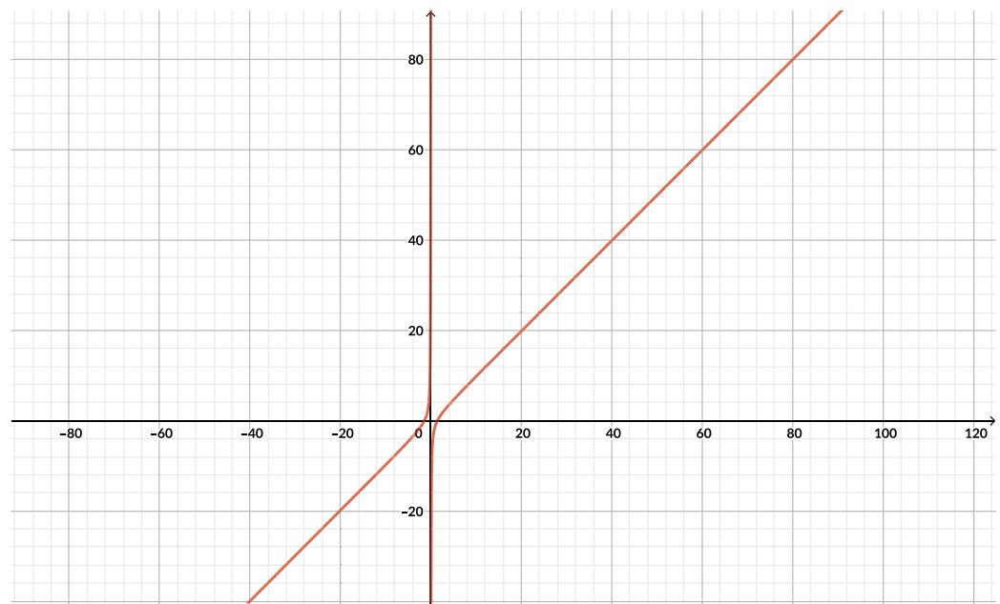

membaca dan memahami masalah, kemudian berpasangan dan secara bergiliran menjelaskan masalahnya, kemudian guru meminta beberapa pasang untuk menjelaskan masalah kepada seluruh kelas.

Tahap ini penting dilakukan untuk membiasakan siswa membaca masalah secara teliti, dan memahami apa yang menjadi inti permasalahan, dan memilah informasi apa yang penting dan relevan. Strategi ini juga melatih kemampuan literasi membaca dari siswa.

Setelah eksplorasi beberapa siswa menyampaikan hasil dan alsannya.

## Perhatian:

Bagian yang kosong dalam tabel memang dilengkapi oleh siswa.

## 1. Melengkapi tabel.

<table><tr><td>Jumlah potong tempe (input)</td><td>Jumlah Keripik yang dihasilkan</td></tr><tr><td>200</td><td>1200</td></tr><tr><td>200,25</td><td>1200</td></tr><tr><td>500,75</td><td>3000</td></tr><tr><td>...</td><td></td></tr><tr><td>600</td><td>3600</td></tr><tr><td>601</td><td>0 (karena mesin berhenti)</td></tr></table>

2. $\{ x | 2 0 0 \leq x \leq 6 0 0 , x \in R \}$

3. $\{ y \mid 1 2 0 0 \leq y \leq 3 6 0 0 , y \in R \}$

4. $\begin{array} { r l } & { \left\{ y \mid 1 2 0 0 \leq y \leq 3 6 0 0 , y \in Z ^ { + } \right\} } \\ & { \mathrm { p o s i t i f } } \end{array}$ dimana Z+ merupakan bilangan bulat

5. Range selalu menjadi subhimpunan dari kodomain.

Setelah diskusi kelompok dan kelas, guru dapat menyimpulkan hasil temuan, yaitu

● pengertian domain, kodomain dan range terlihat jelas dalam konteks nyata

● penulisan range yang tepat

Guru menggunakan penjelasan gambar 1.11 dan 1.12 untuk memantapkan pengertian domain dan range dan penulisannya dalam notasi himpunan.

Berikan lagi satu contoh jika ada yang belum paham untuk menentukan domain, kodomain dan range serta penulisannya dalam notasi himpunan.

## Ayo Berkomunikasi

Siswa menjelaskan pengertian domain dan range dengan kata-kata sendiri. Guru meminta siswa memperhatikan gambar 1.13 untuk menjelaskan pengertiannya.

## Ayo Berpikir Kritis

Kalian sudah memahami penggunaan domain, kodomain dan range dalam kehidupan sehari-hari. Berikan contoh lain dalam kehidupan nyata yang membedakan pengertian kodomain dan range.

Contoh adalah relasi antara harga barang dengan jumlah barang dalam satuan.

## Masalah Ketiga

Pada eksplorasi bagian ketiga ini siswa perlu paham bagaimana fungsi terdefinisi. Grafik sangat menolong untuk menentukan fungsi terdefinisi.

Perhatikan dua grafik dalam gambar 1.14.

a. Grafik fungsi akar.

1) Kita tahu bahwa karena adanya akar kuadrat, kedua fungsi masingmasing hanya mengambil input $x \geq 0$ dan $x - 1 \geq 0$ . Jadi domain dari masing-masing fungsi ialah semua bilangan riil non negatif (untuk fungsi pertama) dan semua bilangan riil lebih dari sama dengan 1 (untuk fungsi kedua).

2) $\{ x \mid x \geq 0 , x \in R \} , \{ x \mid x \geq 1 , x \in R \}$

b. Fungsi $f ( x ) = { \frac { x ^ { 2 } - 2 } { x } }$ memiliki domain yang ditentukan oleh pembaginya. Dalam hal ini pembaginya ialah semua nilai x riil dan bukan 0. Range adalah semua bilangan riil. Hal ini bisa dilihat dari grafik di bawah ini:

Setelah diskusi kelompok dan kelas, guru dapat menyimpulkan hasil temuan, yaitu

● pentingnya memahami fungsi terdefinisi

● penulisan domain dan range yang tepat.

Guru menekankan bahwa penentuan domain dan range suatu fungsi berkaitan dengan konteksnya. Contoh, biaya pembuatan kue diberikan oleh B x^ h = + 40000 10x dengan x adalah jumlah kue. Jika digambarkan maka fungsi ini berupa garis lurus dan domainnya adalah x > 0 dengan x merupakan bilangan bulat. Rangenya juga merupakan bilangan bulat. Minta siswa menemukan contoh-contoh lain yang menunjukkan konteks untuk menentukan domain, kodomain dan range.

Guru dapat memberikan contoh-contoh lain untuk menentukan domain dan range dari fungsi eksponensial dan fungsi kuadrat. Gunakan grafik terlebih dahulu dilanjutkan dengan bentuk aljabar fungsi.