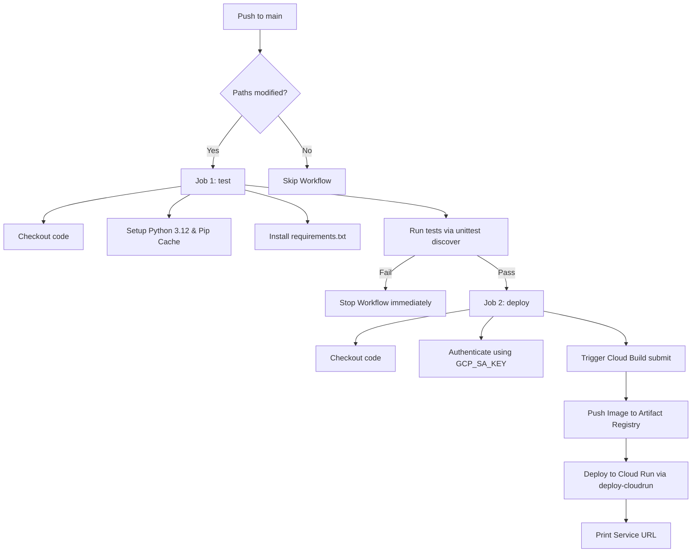

# CI/CD Deployment Pipeline & DevOps Documentation

This document describes the design, deployment flow, security considerations, and rollback procedures for the production-ready CI/CD pipeline of the Inclusia Flask backend.

---

## 1. Architecture & CI/CD Flow

The pipeline is implemented using GitHub Actions and executes on every push to the `main` branch when changes are detected in either the `backend/` directory or the workflow definition itself.



### Flow Stages
1. **Triggering**: Push to the `main` branch.
2. **Lint & Test**: Installs dependencies and runs all unit and integration tests under `backend/tests/`. If any test fails, execution halts immediately.
3. **Authentication**: Authenticates securely using GCP service account credentials stored in GitHub Secrets.
4. **Cloud Build**: Sends the source code to Google Cloud Build to run the Docker build and push the built image directly to Artifact Registry.
5. **Cloud Run Deployment**: Deploys the built image using the latest configuration flags:
   - Memory: `1Gi`
   - CPU: `1`
   - Concurrency: `20`
   - Instances: Min `0` / Max `5`
   - Ingress: `--allow-unauthenticated`
6. **Verification**: Prints the resulting Cloud Run Service URL.

---

## 2. GitHub Secrets Configuration

Here is the list of required GitHub Secrets that must be added to your repository under **Settings > Secrets and variables > Actions > New repository secret**:

| Secret Name | Explanation / Example Value |
|-------------|-----------------------------|
| `GCP_PROJECT_ID` | The ID of your Google Cloud Project. Example: `inclusia-501005` |
| `GCP_REGION` | The region where services are located. Example: `asia-southeast2` |
| `CLOUD_RUN_SERVICE` | The name of the Cloud Run service. Example: `inclusia-backend` |
| `ARTIFACT_REGISTRY_REPOSITORY` | The name of the Artifact Registry repository. Example: `cloud-run-source-deploy` |
| `GCP_SA_KEY` | The JSON key content of the GCP Service Account with deployment permissions. |

---

## 3. Creating the Google Cloud Service Account

To generate the Service Account JSON key, run the following commands in your terminal or use the Google Cloud Console:

```bash
# 1. Create a dedicated service account for GitHub Actions
gcloud iam service-accounts create github-actions-deployer \
    --description="Service account for GitHub Actions CI/CD" \
    --display-name="GitHub Actions Deployer"

# 2. Generate and download the JSON key file
gcloud iam service-accounts keys create credentials.json \
    --iam-account=github-actions-deployer@inclusia-501005.iam.gserviceaccount.com
```

> [!WARNING]
> Keep the downloaded `credentials.json` file secure. Never commit it to git. Once uploaded to GitHub Secrets as `GCP_SA_KEY`, delete the local copy.

---

## 4. Service Account IAM Roles (Principle of Least Privilege)

For security, the service account must only be granted the minimum permissions required to build and deploy. Run the following commands to bind the roles:

```bash
# Grant access to compile images using Cloud Build
gcloud projects add-iam-policy-binding inclusia-501005 \
    --member="serviceAccount:github-actions-deployer@inclusia-501005.iam.gserviceaccount.com" \
    --role="roles/cloudbuild.builds.editor"

# Grant access to upload the Docker container to Artifact Registry
gcloud projects add-iam-policy-binding inclusia-501005 \
    --member="serviceAccount:github-actions-deployer@inclusia-501005.iam.gserviceaccount.com" \
    --role="roles/artifactregistry.writer"

# Grant access to configure and update Cloud Run services
gcloud projects add-iam-policy-binding inclusia-501005 \
    --member="serviceAccount:github-actions-deployer@inclusia-501005.iam.gserviceaccount.com" \
    --role="roles/run.developer"

# Grant access to act as the Cloud Run runtime service account (necessary for service deployment)
gcloud projects add-iam-policy-binding inclusia-501005 \
    --member="serviceAccount:github-actions-deployer@inclusia-501005.iam.gserviceaccount.com" \
    --role="roles/iam.serviceAccountUser"

# Grant access to write logs to Cloud Logging
gcloud projects add-iam-policy-binding inclusia-501005 \
    --member="serviceAccount:github-actions-deployer@inclusia-501005.iam.gserviceaccount.com" \
    --role="roles/logging.logWriter"
```

---

## 5. Uploading Secrets to GitHub

1. Open your repository on GitHub.
2. Navigate to **Settings** > **Secrets and variables** > **Actions**.
3. Click **New repository secret**.
4. Create each secret with its respective name and value:
   - For `GCP_SA_KEY`, paste the entire contents of the downloaded `credentials.json` file.
   - For others, paste their corresponding text values.

---

## 6. How to Trigger and Verify the Pipeline

### Triggering
Make a commit and push to the `main` branch:
```bash
git add .
git commit -m "feat: configure CI/CD pipeline"
git push origin main
```

### Verification
1. Go to the **Actions** tab of your GitHub repository.
2. Select the **Deploy Backend to Google Cloud Run** workflow.
3. Review the logs of the `test` and `deploy` jobs.
4. Ensure the output of the final step prints:
   `Cloud Run URL: https://inclusia-backend-139597626526.asia-southeast2.run.app`
5. Visit the URL to verify that the API is responsive.

---

## 7. Rollback Process

If a deployment fails, crashes, or introduces bugs in production, you can immediately roll back to the previous stable revision without redeploying or rebuilding:

1. List the available revisions:
   ```bash
   gcloud run revisions list \
       --service=inclusia-backend \
       --region=asia-southeast2 \
       --project=inclusia-501005
   ```
2. Route 100% of traffic to the previous stable revision:
   ```bash
   gcloud run services update-traffic inclusia-backend \
       --to-revisions=REVISION_NAME=100 \
       --region=asia-southeast2 \
       --project=inclusia-501005
   ```
   *Replace `REVISION_NAME` with the name of the previous working revision (e.g. `inclusia-backend-00001-4m9`).*

---

## 8. Accessibility Profile Selection

### 8.1. Architecture
We follow the Clean Architecture layers to handle user profiles:
- **Controller Layer** ([profile_routes.py](file:///Users/mjafarshidik/Aktivita/Inclusia/backend/routes/profile_routes.py)): Handles request parsing, validations, and mapping response schemas.
- **Service Layer** ([user_service.py](file:///Users/mjafarshidik/Aktivita/Inclusia/backend/services/user_service.py)): Contains business logic to decide whether to trigger document creation or updating in the database.
- **Database Layer** ([firebase_service.py](file:///Users/mjafarshidik/Aktivita/Inclusia/backend/services/firebase_service.py)): Performs actual Firestore read/write operations on the `users` collection.

### 8.2. Firestore Schema
- **Collection Name**: `users`
- **Document ID**: Firebase UID
- **Attributes**:
  ```json
  {
      "uid": "wJ27Xm...",
      "email": "user@example.com",
      "displayName": "User Full Name",
      "photoUrl": "https://lh3.googleusercontent.com/...",
      "accessibilityMode": "LOW_VISION",
      "createdAt": Timestamp,
      "updatedAt": Timestamp
  }
  ```

### 8.3. REST API & Authentication Flow
Endpoints are protected using standard Firebase Bearer token verification.
- **Set Accessibility Mode**: `POST /api/v1/profile/accessibility`
  - Body: `{"mode": "TOTALLY_BLIND"}`
  - Validation: Returns `400` if the body is missing, `mode` is missing, or `mode` is not one of `TOTALLY_BLIND`, `LOW_VISION`, or `DEAF_HEARING`.
- **Get User Profile**: `GET /api/v1/profile`
  - Response payload includes `displayName`, `photoUrl`, and `accessibilityMode` (which is `null` if the user has never set it).

### 8.4. Validation Rules
- **Missing Body**: Returns `400 {"error": "Missing body"}`.
- **Missing Mode**: Returns `400 {"error": "Missing mode"}`.
- **Invalid Mode**: Returns `400 {"error": "Invalid accessibility mode: <mode>"}`.
- **Authentication**: Returns `401 {"error": "Invalid Firebase token"}` or `401 {"error": "Authentication required"}`.
- **Firestore Exceptions**: Handled gracefully and caught in the routes to return `500 {"error": "Internal server error"}` to protect database schema details.

### 8.5. Logging Spec
All profile logs are structured:
- `profile created: request_id={id}, user_uid={uid}, accessibility_mode={mode}`
- `profile updated: request_id={id}, user_uid={uid}, accessibility_mode={mode}`
- `profile fetched: request_id={id}, user_uid={uid}, accessibility_mode={mode}`
- `profile update failed: request_id={id}, user_uid={uid}, accessibility_mode={mode}, reason={reason}`

### 8.6. Cloud Run Compatibility
- **State-free**: Profile details are stored completely in cloud-native Firestore database rather than local files, maintaining 100% serverless stateless compliance.
- **Thread safety**: Implements concurrent-safe Firestore `.set(..., merge=True)` operations.

### 8.7. Future Extensibility
The `UserService.update_profile` method takes a `Dict[str, Any]` of fields to update, making it extremely easy to add future preferences (e.g., `preferredLanguage`, `theme`, `voiceType`, `textSize`) without modifying the method signatures.

### 8.8. Test Coverage Results
- Created test suite [test_profile_accessibility.py](file:///Users/mjafarshidik/Aktivita/Inclusia/backend/tests/test_profile_accessibility.py) covering:
  - Create profile
  - Update profile
  - Fetch profile (set and unset states)
  - Validation limits (invalid mode, missing body, missing parameters, unauthorized access)
  - Firestore exception handling
- Verified: Ran `python -m unittest discover -s tests -p "test_*.py"` inside `backend/` and all tests passed successfully:
  ```
  Ran 46 tests in 1.194s

  OK
  ```

